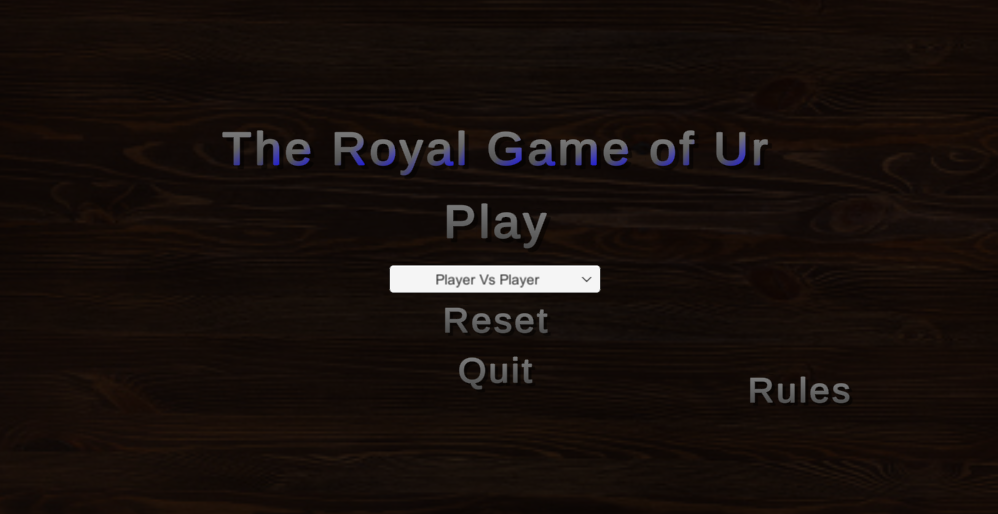
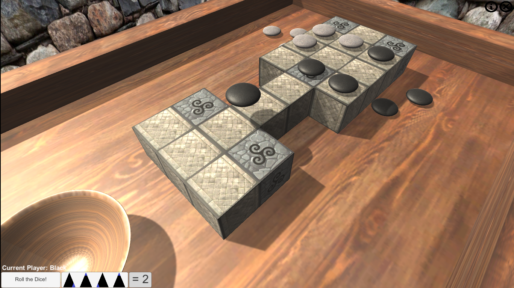
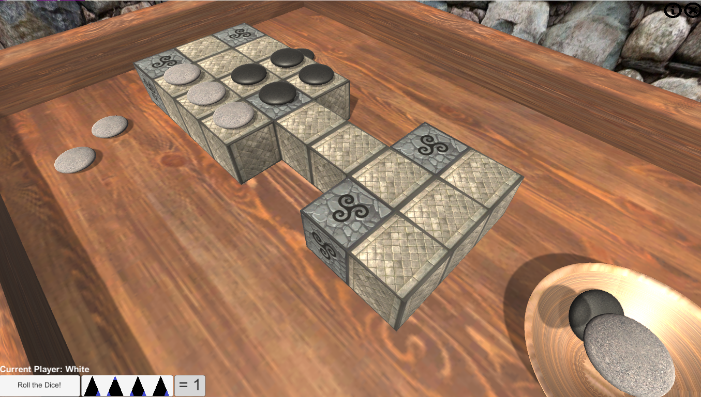

<h1>The Royal Game of Ur</h1>

I decided to create this game orimarlity to test out the Unity game engine and gorw my skills for future endevours.

I was able to work on:

<ul>
  <li>3d Objects</li>
  <li>Unity Physics</li>
  <li>Player Turns</li>
  <li>AI Players</li>
  <li>and much, much more!</li>
</ul>

I have always been a huge fan of board games, and was immediatly intruiged when coming accross The Royal Game of Ur. The oldest known board game, it is beleived to have been first played well over 4500 years ago. I wanted to take the seemingly <a href="https://www.mastersofgames.com/rules/royal-ur-rules.htm">simple rules</a> and turn it into a functional, fun video game for myself and my friends to enjoy.
 

